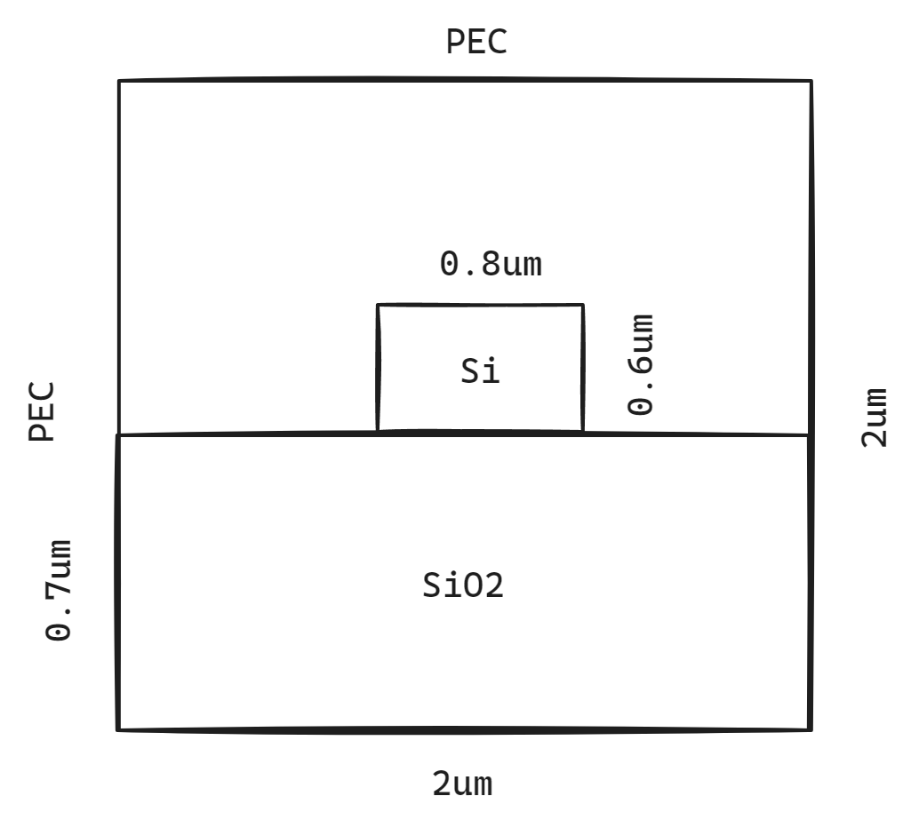

# FDEsolver 求解器

有限差分特征模 (FDE) 求解器通过求解波导横截面网格上的麦克斯韦方程，计算模式的空间分布和频率依赖性。该求解器计算模场分布、有效折射率和损耗。集成频率扫描功能可轻松计算群延迟、色散等。该求解器还可以处理弯曲波导。

## 物理

$E_x (x,y)e^{i (-\omega t + \beta z)}$

$H_x (x,y)e^{i (-\omega t + \beta z)}$

其中， $\omega$ 为角频率， $\beta$ 为传播常数。模态有效折射率定义为

$neff = \frac{c\beta}{\omega}$

特征求解器通过求解波导横截面网格上的麦克斯韦方程来找到这些模式。有限差分算法是目前用于对波导几何结构进行网格划分的方法，能够适应任意波导结构。一旦结构完成网格划分，麦克斯韦方程就被转化为矩阵特征值问题，并使用稀疏矩阵技术进行求解，从而获得波导模式的有效折射率和模式分布。

## 测试模型

### 矩形波导

结构模型

### 光纤

